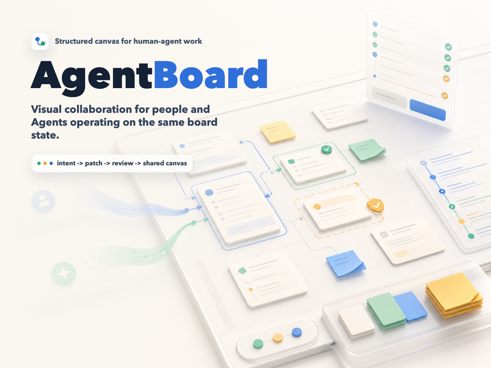

# AgentBoard

**Agent-native structured canvas** — 一个 local-first 的结构化白板，让人和 AI Agent 围绕同一份白板状态协作。

[English README](./README.en.md)




AgentBoard 把和 Agent 的对话变成一张可编辑画布。用户可以让 Agent 拆解产品、梳理 workflow、画架构图或决策树；Agent 返回结构化白板操作；用户再移动卡片、编辑文字、创建连线，并基于更新后的白板继续对话。

## 它能做什么

- 用自然语言创建可编辑的卡片、便签、分组和连线。
- 在发送前明确 Agent 的作用范围和权限：整张白板或选中节点，以及是否允许改写、删除和全图布局。
- 对新增等低风险变更自动应用；删除、内容改写和全图布局等高风险变更先展示提案，确认后才落板。
- 在 Agent 完成后汇总并高亮受影响对象，支持一键撤销、持久化撤销/重做历史。
- 白板以结构化 `BoardDSL` 存储，而不是一张扁平图片。
- Agent 输出通过经过校验的 `DSLPatch` 操作应用到白板，超出授权范围的操作会被确定性拦截。
- Agent 可以读取最近的人类编辑增量，不必每次都读取完整白板。
- 通过 Vite 开发服务器桥接本地 CLI Agent，例如 Claude Code、OpenCode、Pi CLI、Codex CLI、Gemini CLI、Antigravity、Qwen Code、Cursor Agent、GitHub Copilot CLI、Qoder、Kimi 和 Trae。
- 支持 Claude API 和 OpenAI 兼容 API。
- 白板 session、操作历史和 Agent 设置保存在本机浏览器 `localStorage`，并支持白板导入、导出与本地备份恢复。

## 为什么需要它

很多 Agent 产品会把上下文丢在冗长聊天记录里。AgentBoard 用画布本身作为共享的外部记忆：

```txt
人的意图
  -> Agent 规划结构化白板变更
  -> AgentBoard 校验并应用 DSLPatch
  -> 人编辑可见画布
  -> Agent 读取更新后的结构和最近编辑
```

关键不是“AI 画了一张图”，而是人和 Agent 一直在操作同一个结构化对象。

## 核心协作体验

AgentBoard 把一次 Agent 调用设计成可理解、可授权、可恢复的协作事务：

1. **选择起点**：空白白板会检测本地 CLI，并提供产品拆解、技术架构和执行计划三个起始任务。
2. **限定范围**：发送前可指定作用于整张白板或选中节点，并分别控制改写、删除和全图布局权限。
3. **观察执行**：运行中展示读取上下文、调用 Agent、校验输出和应用结果四个阶段，也可以随时停止。
4. **审阅风险**：低风险新增可直接应用；高风险修改必须先查看摘要并确认，白板不会被静默覆盖。
5. **继续共创**：完成后会高亮变化并提供撤销；人工移动、改字或连线后，Agent 可读取这些增量继续完善。

右侧“历史”分为两个视图：

- **协作记录**：用户指令、Agent 修改、确认请求和可恢复操作。
- **运行日志**：CLI 调用、重试、结构校验和错误详情。

## 快速开始

```bash
git clone https://github.com/AyingAI/agentboard.git
cd agentboard
npm install
npm run dev
```

打开 `http://localhost:5173`。

然后在设置面板选择 Agent 提供方：

- **Local CLI**：自动检测受支持的本地 CLI，例如 Claude Code、OpenCode、Pi CLI、Codex CLI、Gemini CLI、Antigravity、Qwen Code、Cursor Agent、GitHub Copilot CLI、Qoder、Kimi 和 Trae。
- **Claude API**：使用 Anthropic API key。
- **OpenAI-compatible API**：使用 OpenAI 或兼容的 base URL。

推荐优先使用 **Local CLI**。它会复用你本机已经配置好的 Agent 工具，通常能获得更完整的 Agent 体验：可以使用本地 CLI 自带的搜索、文件读写、命令执行和 skill 能力，而不只是让模型生成一段文本。

Claude API 和 OpenAI-compatible API 适合轻量使用，例如快速整理白板、生成结构化节点或在没有本地 CLI 的环境下试用。当前 API 模式主要负责文本推理和结构化输出，不会自动拥有本地 CLI 的工具能力。

API key 只保存在浏览器 `localStorage`。不要把 secrets 提交到仓库。

首次打开空白白板时，可以直接使用检测到的本地 CLI，也可以先选择一个起始任务补充后发送。画布左上角提供创建卡片、缩放、适应内容和快捷键帮助。

## 画布基础操作

| 操作 | 交互 |
| --- | --- |
| 创建卡片 | 点击左上角“+ 卡片”，或双击画布空白处 |
| 移动卡片 | 拖拽；框选后可批量移动 |
| 编辑卡片文字 | 双击标题或正文 |
| 创建连线 | 选中节点，拖拽连接点到另一个节点 |
| 编辑连线标签 | 选中或双击连线标签 |
| 删除选中内容 | Delete 或 Backspace |
| 平移画布 | Space + 拖拽，或鼠标中键拖拽 |
| 缩放画布 | 左上角缩放按钮，或 `Cmd/Ctrl + 滚轮` |
| 适应全部内容 | 点击左上角“适应内容” |
| 撤销 / 重做 | `Cmd/Ctrl + Z` / `Cmd/Ctrl + Shift + Z`（Windows 也支持 `Ctrl + Y`） |
| 查看快捷键 | 点击左上角 `?`，或直接按 `?` |

## 核心协议

AgentBoard 围绕一个很小的白板协议构建。

### `BoardDSL`

`BoardDSL` 是可见白板的事实来源：

```ts
type BoardDSL = {
  version: string;
  board: { id: string; title: string; viewport: { x: number; y: number; zoom: number } };
  nodes: BoardNode[];
  edges: BoardEdge[];
  groups: BoardGroup[];
  metadata: Record<string, unknown>;
};
```

### `DSLPatch`

Agent 不直接修改白板。它返回一个 patch：

```ts
type DSLPatch = {
  type: 'dsl_patch';
  summary: string;
  ops: PatchOp[];
  questions?: string[];
};
```

支持的操作包括 `add_node`、`update_node`、`delete_node`、`add_edge`、`delete_edge`、`add_group`、`update_group`、`delete_group` 和 `layout`。

每个 patch 都会先校验再应用。无效引用、重复 ID、无效几何信息、schema 不匹配或超出用户授权范围，都会让 patch 原子失败，不会留下半更新状态。删除节点或分组、改写现有内容、全图布局等高风险操作还需要用户明确确认。

### 本地数据与恢复

- 每张白板独立保存最多 25 步撤销和重做历史，刷新或切换白板后仍然可用。
- 白板菜单支持导出版本化 `.agentboard.json`，也可以导入该格式或原始 `BoardDSL` JSON。
- 导入文件会先经过结构与引用校验，并作为新白板打开，不覆盖现有工作。
- 每次保存会保留上一份本地 session 数据；主存储损坏时会尝试恢复备份并明确提示用户导出。

### 增量上下文包

当用户编辑白板后再次调用 Agent，AgentBoard 默认发送紧凑的增量上下文：

- 已变化的编辑事件
- 已变化的节点 ID 和连线 ID
- 已变化节点的完整对象
- 与变化节点相关的连线
- 附近节点的轻量摘要
- 紧凑的白板摘要

全局任务，例如整图整理、导出或流程执行，仍然会接收完整白板上下文。

## 架构

```txt
React app
  ├── BoardDSL state
  ├── patch engine
  ├── validation engine
  ├── canvas renderer
  └── agent adapters
        ├── local CLI bridge
        ├── Claude API
        └── OpenAI-compatible API
```

项目结构：

```txt
src/
  types/dsl.ts           # 协议和共享类型
  engine/                # patch 应用和校验
  agent/                 # 适配器、prompt、解析、韧性处理
  hooks/                 # React 状态、拖拽、平移、session
  components/            # 画布和 UI 组件
  data/                  # 初始白板模板
  storage.ts             # localStorage 持久化
agentBridgePlugin.ts     # 用于本地 CLI 执行的 Vite middleware
```

## 开发

```bash
npm run dev        # 启动 Vite 开发服务器
npm run typecheck  # TypeScript 校验
npm run test       # Vitest 测试
npm run build      # 生产构建
```

## 当前状态

AgentBoard 仍是原型。它适合用于实验结构化 Agent 协作，但还不是一个托管式多人产品。

当前边界：

- 仅支持 local-first 存储，但可通过 `.agentboard.json` 手动备份和迁移。
- 没有服务端账号、权限、多人协作或云同步模型。
- 本地 CLI bridge 只在 Vite 开发服务器中运行。
- API key 仍保存在浏览器 `localStorage`；共享设备上请谨慎使用。
- 外部副作用应保持显式，并由用户授权。

## 贡献

欢迎提交 issue 和 pull request。提交变更前请运行：

```bash
npm run typecheck
npm run test
npm run build
```

贡献指南见 [CONTRIBUTING.md](CONTRIBUTING.md)。

## License

MIT. See [LICENSE](LICENSE).
